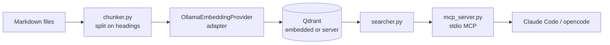

# recall

[](tests/) [](pyproject.toml) [](#license)

Local semantic search over your project documentation — zero API cost, fully offline.

## Overview

**recall** is a RAG (Retrieval-Augmented Generation) pipeline that indexes your Markdown docs into a local Qdrant vector store using Ollama embeddings, then exposes search as an MCP tool to Claude Code and opencode. No cloud services, no token spend on retrieval, no server to run.

```
markdown files → chunker → Ollama (nomic-embed-text) → Qdrant (embedded) → MCP (recall-mcp)
                                                                                 ↑
                                                                     Claude Code / opencode
```

## Quick Start

**Prerequisites:** [uv](https://docs.astral.sh/uv/getting-started/installation/), [Ollama](https://ollama.com/download)

```bash
# 1. Clone and bootstrap
git clone git@github.com:goriok/recall.git
cd recall
./bootstrap.sh          # installs CLI, pulls embedding model, copies config

# 2. Edit your config
$EDITOR ~/.config/recall/recall.toml

# 3. Index your docs
recall ingest --all

# 4. Search
recall search "authentication flow"
```

Qdrant runs embedded — an on-disk store at `~/.local/share/recall/qdrant` by default, no server process, no Podman/Docker required. See [Server mode](#server-mode-optional) if you need concurrent access from multiple processes at once.

## Features

- **Auto-discover projects** — point at a `~/sources` root; every subdir with `.md` files becomes a searchable collection
- **Explicit projects** — override path, collection name, and glob per project
- **MCP server** — `recall-mcp` exposes `search_docs` tool to Claude Code and opencode via stdio
- **Idempotent ingest** — deterministic chunk IDs; re-running ingest is always safe
- **Embedded by default** — Qdrant's local mode (on-disk SQLite), zero infrastructure to run

## Architecture

Hexagonal (ports & adapters — see `docs/madrs/`):



`indexer.py`/`searcher.py` depend only on the `VectorStore`/`EmbeddingProvider` ports
(`core/interfaces.py`) — `adapters/qdrant_vector_store.py` and
`adapters/ollama_embedding_provider.py` are the concrete implementations, injected at the
command/MCP layer.

## Configuration

`~/.config/recall/recall.toml` (global) or `recall.toml` (project-local, walked upward from CWD).

### Qdrant + Embedding

```toml
[qdrant]
# Embedded mode (default) — omit this section entirely to use
# ~/.local/share/recall/qdrant, or set path explicitly:
path = "~/.local/share/recall/qdrant"

[embedding]
model = "nomic-embed-text"
provider = "ollama"
ollama_host = "http://localhost:11434"
```

#### Server mode (optional)

Only needed for concurrent access from multiple processes at once (e.g. running `recall search`
from the CLI while a `recall-mcp` session is also open against the same data). Set `host`/`port`
instead of `path`:

```toml
[qdrant]
host = "localhost"
port = 6333
```

With `host` set, `recall` auto-starts a Qdrant server via `podman compose up -d` if port 6333 is
unreachable (`docker-compose.yml`, requires Podman).

### Projects

```toml
# Explicit project with custom settings
[[projects]]
name = "my-project"
path = "~/sources/my-project/docs"
collection = "my-project"
glob = "**/*.md"

# Auto-discover: every subdir of root becomes a collection
[[sources]]
root = "~/sources"
glob = "**/*.md"
exclude = ["node_modules", ".venv", "dist", "__pycache__", ".git"]
```

## Usage

```bash
# Ingest
recall ingest                                    # explicit projects from config
recall ingest --all                              # all auto-discovered + explicit
recall ingest --project my-project              # single project

# Search
recall search "deployment process"
recall search "auth" --project my-project --top-k 10

# Collections
recall collections list
recall collections drop my-project --yes

# MCP server (stdio — launched by Claude Code / opencode automatically)
recall-mcp
```

### MCP Configuration

**opencode** — add to `~/.config/opencode/opencode.jsonc`:
```jsonc
"recall": { "type": "local", "command": ["recall-mcp"], "enabled": true }
```

**Claude Code** — add to `~/.claude/settings.json`:
```json
"mcpServers": {
  "recall": { "type": "stdio", "command": "recall-mcp" }
}
```

## Project Structure

```
src/recall/
├── cli.py                            # Typer app entry point
├── config.py                         # Config dataclasses + auto-discover logic
├── chunker.py                        # Markdown → chunks with deterministic IDs
├── indexer.py                        # Chunk + embed + upsert pipeline (ports only)
├── searcher.py                       # Semantic search (ports only)
├── qdrant_guard.py                   # Auto-start Qdrant server via podman compose (server mode only)
├── mcp_server.py                     # FastMCP stdio server (search_docs tool)
├── core/interfaces.py                # VectorStore, EmbeddingProvider ports
├── adapters/
│   ├── qdrant_vector_store.py        # VectorStore adapter (embedded or server)
│   └── ollama_embedding_provider.py  # EmbeddingProvider adapter
└── commands/                         # Typer command handlers
```

## Contributing

See [CONTRIBUTING.md](CONTRIBUTING.md).

## License

MIT
