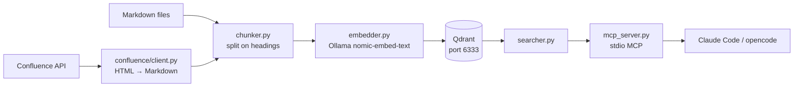

# recall

[](tests/) [](pyproject.toml) [](#license)

Local semantic search over your project documentation — zero API cost, fully offline.

## Overview

**recall** is a RAG (Retrieval-Augmented Generation) pipeline that indexes your Markdown docs into a local Qdrant vector database using Ollama embeddings, then exposes search as an MCP tool to Claude Code and opencode. No cloud services, no token spend on retrieval.

```
markdown files → chunker → Ollama (nomic-embed-text) → Qdrant → MCP (recall-mcp)
                                                                      ↑
                                                          Claude Code / opencode
```

## Quick Start

**Prerequisites:** [uv](https://docs.astral.sh/uv/getting-started/installation/), [Ollama](https://ollama.com/download), [Podman](https://podman.io/) with `podman-compose`

```bash
# 1. Clone and bootstrap
git clone https://github.com/goriok/recall.git
cd recall
./bootstrap.sh          # installs CLI, pulls embedding model, copies config

# 2. Start Qdrant (auto-started on first recall command, or manually)
podman compose up -d

# 3. Edit your config
$EDITOR ~/.config/recall/recall.toml

# 4. Index your docs
recall ingest --all

# 5. Search
recall search "authentication flow"
```

## Features

- **Auto-discover projects** — point at a `~/sources` root; every subdir with `.md` files becomes a searchable collection
- **Explicit projects** — override path, collection name, and glob per project
- **Confluence ingestor** — index entire spaces, page trees, or labelled pages from Cloud or Server/DC
- **MCP server** — `recall-mcp` exposes `search_docs` tool to Claude Code and opencode via stdio
- **Idempotent ingest** — deterministic chunk IDs; re-running ingest is always safe
- **Auto-start Qdrant** — `podman compose up -d` runs automatically if Qdrant is unreachable

## Architecture



## Configuration

`~/.config/recall/recall.toml` (global) or `recall.toml` (project-local, walked upward from CWD).

### Qdrant + Embedding

```toml
[qdrant]
host = "localhost"
port = 6333

[embedding]
model = "nomic-embed-text"
provider = "ollama"
ollama_host = "http://localhost:11434"
```

### Projects

```toml
# Explicit project with custom settings
[[projects]]
name = "my-project"
path = "~/sources/my-project/docs"
collection = "my-project"
glob = "**/*.md"

# Auto-discover: every subdir of root becomes a collection
[[sources]]
root = "~/sources"
glob = "**/*.md"
exclude = ["node_modules", ".venv", "dist", "__pycache__", ".git"]
```

### Confluence

```toml
[confluence]
url = "https://yourorg.atlassian.net"   # or https://confluence.internal.com for Server
auth_type = "token"
email = "{env:CONFLUENCE_EMAIL}"        # Cloud only
token = "{env:CONFLUENCE_TOKEN}"
```

| Variable | Description | Required | Default |
|---|---|---|---|
| `qdrant.host` | Qdrant hostname | No | `localhost` |
| `qdrant.port` | Qdrant port | No | `6333` |
| `embedding.model` | Ollama model name | No | `nomic-embed-text` |
| `confluence.url` | Confluence base URL | Yes (for Confluence) | — |
| `confluence.token` | API token | Yes (for Confluence) | — |
| `confluence.email` | User email | Cloud only | — |

## Usage

```bash
# Ingest
recall ingest                                    # explicit projects from config
recall ingest --all                              # all auto-discovered + explicit
recall ingest --project my-project              # single project

recall ingest-confluence --space ENG             # entire Confluence space
recall ingest-confluence --page-id 123456        # page tree
recall ingest-confluence --label architecture    # by label
recall ingest-confluence --all                   # all accessible pages

# Search
recall search "deployment process"
recall search "auth" --project my-project --top-k 10

# MCP server (stdio — launched by Claude Code / opencode automatically)
recall-mcp
```

### MCP Configuration

**opencode** — add to `~/.config/opencode/opencode.jsonc`:
```jsonc
"recall": { "type": "local", "command": ["recall-mcp"], "enabled": true }
```

**Claude Code** — add to `~/.claude/settings.json`:
```json
"mcpServers": {
  "recall": { "type": "stdio", "command": "recall-mcp" }
}
```

## Project Structure

```
src/recall/
├── cli.py              # Typer app entry point
├── config.py           # Config dataclasses + auto-discover logic
├── chunker.py          # Markdown → chunks with deterministic IDs
├── embedder.py         # Ollama embedding calls
├── indexer.py          # Chunk + embed + upsert pipeline
├── searcher.py         # Qdrant query_points wrapper
├── qdrant_guard.py     # Auto-start Qdrant via podman compose
├── mcp_server.py       # FastMCP stdio server (search_docs tool)
├── commands/           # Typer command handlers
└── confluence/
    ├── client.py       # ConfluenceClient + HTML→Markdown
    ├── config.py       # load_confluence_config + {env:VAR} resolution
    └── indexer.py      # index_confluence_pages pipeline
```

## Contributing

See [CONTRIBUTING.md](CONTRIBUTING.md).

## License

MIT
