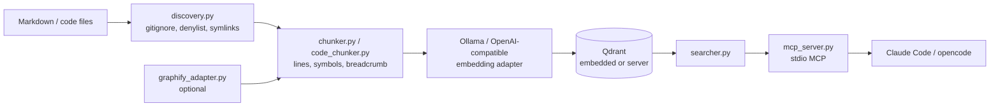

# recall

[](tests/) [](pyproject.toml) [](#license)

Semantic search over your project documentation and source code — local by default, with line-accurate results for code agents.

## Overview

**recall** is a RAG (Retrieval-Augmented Generation) pipeline that indexes your Markdown docs and source code into a Qdrant vector store, then exposes search as MCP tools to Claude Code and opencode. Embeddings come from local Ollama by default, or from an OpenAI-compatible endpoint such as your company's AI gateway (it only computes vectors — nothing is stored there). Qdrant runs embedded or as a server.

```
markdown / code → chunker (lines, symbols, breadcrumb) → embeddings (Ollama | OpenAI-compatible endpoint) → Qdrant → MCP (recall-mcp)
                       ↑ Graphify (optional): community, god nodes, related symbols                    ↑
                                                                                           Claude Code / opencode
```

Every result carries `repo_name`, a repo-relative `file_path` and the `start_line`–`end_line` range, so an agent can open and edit the real file.

## Quick Start

### As a plugin (Claude Code, Hermes, Antigravity)

One repository ships the MCP server and the `recall-search` skill, packaged once per host. In all cases `recall-mcp` runs on demand via `uvx` — no clone, no `uv tool install` — and still needs a `recall.toml` (see [Configuration](#configuration)) and an embedding provider: [Ollama](https://ollama.com/download) with `ollama pull nomic-embed-text`, or a remote OpenAI-compatible endpoint.

**Claude Code**

```
/plugin marketplace add goriok/recall
/plugin install recall@recall
```

This registers the `recall-mcp` MCP server and the skill (as `recall:recall-search`). **To update:** `/plugin marketplace update goriok/recall`, then `/reload-plugins`.

**Hermes** (`hermes-cli`) — a portable Agent Plugins v1 package in `plugins/hermes/` (`plugin.json` + `mcp.json` + `skills/`):

```bash
hermes plugins install goriok/recall#plugins/hermes
hermes plugins enable recall
```

Portable packages install disabled, so the enable step is required. The package lives in a subdirectory because Hermes co-installs the Python dependencies of any plugin that has a `pyproject.toml` at its root, which would clash with Hermes' own `mcp` pin; `recall-mcp` runs isolated through `uvx`. Hermes passes an MCP server only a safe subset of the environment (`PATH`, `HOME`, `XDG_*`, ...), `recall` itself reads `~/.config/recall/.env` (`HOME` is in that safe subset), so keep the endpoint and key there; no extra Hermes configuration is needed. **To update:** `hermes plugins update recall`.

To get just the skill as a slash command (`/recall-search`) and skip the MCP server, use the skills route instead: `hermes skills tap add goriok/recall` then `hermes skills install goriok/recall/recall-search`.

**Antigravity (`agy`)**

```bash
git clone git@github.com:goriok/recall.git
agy plugin install ./recall/plugins/recall
```

`plugins/recall/` is this repo's `agy`-native plugin folder: `plugin.json`, `mcp_config.json` (registering `recall-mcp` over stdio) and a `skills/` symlink to the same `skills/` directory the other hosts use — one skill source, no duplicate content. `agy plugin install` copies that registration into `agy`'s own local config (`~/.gemini/config/plugins/recall/`); it is **not** a live link back to the clone. **To update:** `git pull`, then re-run `agy plugin install ./recall/plugins/recall`. Run `agy plugin validate ./recall/plugins/recall` first to confirm the folder is well-formed.

**Maintaining the manifests:** `.claude-plugin/plugin.json`, `plugins/hermes/plugin.json` and `pyproject.toml` must carry the same version, and `plugins/hermes/skills/` must be a byte-for-byte copy of `skills/` (both enforced by `tests/test_plugin_packaging.py`; refresh it with `rm -r plugins/hermes/skills && cp -r skills plugins/hermes/skills`). Skills are authored only in `skills/<name>/SKILL.md`. Validate with `claude plugin validate .`, `hermes plugins validate ./plugins/hermes` and `agy plugin validate ./plugins/recall`.

### CLI, standalone

**Prerequisites:** [uv](https://docs.astral.sh/uv/getting-started/installation/), [Ollama](https://ollama.com/download)

```bash
# 1. Clone and bootstrap
git clone git@github.com:goriok/recall.git
cd recall
./bootstrap.sh          # installs CLI, pulls embedding model, copies config

# 2. Edit your config
$EDITOR ~/.config/recall/recall.toml

# 3. Index your docs
recall ingest --all

# 4. Search
recall search "authentication flow"
```

Qdrant runs embedded — an on-disk store at `~/.local/share/recall/qdrant` by default, no server process, no Podman/Docker required. See [Server mode](#server-mode-optional) if you need concurrent access from multiple processes at once.

## Features

- **Auto-discover projects** — point at a `~/sources` root; every subdir with `.md` files becomes a searchable collection
- **Explicit projects** — override path, collection name, and glob per project
- **Code repos** — `[[repos]]` index source code: Python by function/method/class (`ast`); Go, JavaScript and Rust by symbol via tree-sitter (optional `recall[code]` extra); YAML by key path (`base-webapp.image`, stdlib scanner, optional `path_labels` prefix such as `env=prod region=ne1` for multi-environment IaC); other languages by overlapping line windows. Each chunk has `file_path`, `start_line`, `end_line`, `symbol_name`; doc comments, JSDoc and Rust attributes stay with the symbol they document
- **Graphify enrichment (optional)** — `community_name`, `is_god_node` and `related_symbols` per chunk, no LLM calls
- **Line-accurate docs** — Markdown chunks record their line span and heading breadcrumb; headings inside fenced code are ignored
- **MCP server** — `recall-mcp` exposes `search_docs`, `search_code` and `explain_architecture` over stdio
- **Idempotent ingest** — IDs are stable (no positional index); re-ingest replaces changed files and removes deleted ones
- **Embedded by default** — Qdrant's local mode (on-disk SQLite), zero infrastructure to run; optional server mode with gRPC, https and API key
- **Pluggable embeddings** — Ollama or a remote OpenAI-compatible endpoint per project; collections remember their model and refuse mismatched searches

## Architecture

Hexagonal (ports & adapters — see `docs/madrs/`):


```mermaid
graph LR
    A[Markdown / code files] --> A2[discovery.py<br/>gitignore, denylist, symlinks]
    A2 --> B[chunker.py / code_chunker.py<br/>lines, symbols, breadcrumb]
    G2[graphify_adapter.py<br/>optional] --> B
    B --> C[Ollama / OpenAI-compatible<br/>embedding adapter]
    C --> D[(Qdrant<br/>embedded or server)]
    D --> E[searcher.py]
    E --> F[mcp_server.py<br/>stdio MCP]
    F --> G[Claude Code / opencode]
```

`indexer.py`/`searcher.py` depend only on the `VectorStore`/`EmbeddingProvider` ports
(`core/interfaces.py`) — `adapters/qdrant_vector_store.py`, `adapters/ollama_embedding_provider.py`
and `adapters/openai_embedding_provider.py` are the concrete implementations, injected per project
at the command/MCP layer (`embeddings.py`). `recall-meta` records which model built each
collection. See [MADR-003](docs/madrs/MADR-003-code-repos-line-metadata-and-remote-embeddings.md) and the step-by-step [runbooks](docs/README.md#runbooks).

## Configuration

`~/.config/recall/recall.toml` (global) or `recall.toml` (project-local, walked upward from CWD).

### Qdrant + Embedding

```toml
[qdrant]
# Embedded mode (default) — omit this section entirely to use
# ~/.local/share/recall/qdrant, or set path explicitly:
path = "~/.local/share/recall/qdrant"

[embedding]
model = "nomic-embed-text"
provider = "ollama"
ollama_host = "http://localhost:11434"
```

#### Remote embeddings (OpenAI-compatible endpoint)

Keep the endpoint and the key out of every repository: put them in `~/.config/recall/.env`. `recall` reads only the `RECALL_*` variables of that global file (never a `.env` from the working directory, never other variables), and a `recall.toml` then needs no `[embedding]` table at all:

```bash
# ~/.config/recall/.env
RECALL_EMBEDDING_BASE_URL=https://embeddings.example.com/v1
RECALL_EMBEDDING_MODEL=nomic-embed-text-v1-5      # 768 dims
RECALL_EMBEDDING_API_KEY=<API_KEY>
```

Optional: `RECALL_EMBEDDING_PROVIDER` (`openai` is implied by a base URL), `RECALL_EMBEDDING_API_KEY_ENV` (name of another variable holding the key) and `RECALL_EMBEDDING_BATCH_SIZE` (at most 32; larger values are rejected). The same settings can be written as an `[embedding]` table (`provider`, `model`, `base_url`, `api_key_env`, `batch_size`), but then the endpoint lives in a file you may commit — prefer the `.env`.

A `recall.toml` found in a project directory is treated as untrusted: it can only point at remote endpoints that your global setup already declares (the host in `RECALL_EMBEDDING_BASE_URL`, hosts in the global `recall.toml`, `[security] trusted_hosts` or `RECALL_TRUSTED_HOSTS`), and only with the key variable the global file pairs with that host. See [MADR-003](docs/madrs/MADR-003-code-repos-line-metadata-and-remote-embeddings.md).

`[[sources]]`, `[[projects]]` and `[[repos]]` accept their own `[x.embedding]` table to override the global one (for example `provider = "ollama"` for personal content). Vectors from different providers are not comparable: changing a collection's model requires `recall ingest <project> --recreate`.

#### Server mode (optional)

Only needed for concurrent access from multiple processes at once (e.g. running `recall search`
from the CLI while a `recall-mcp` session is also open against the same data). Set `host`/`port`
instead of `path`:

```toml
[qdrant]
host = "localhost"
port = 6333
prefer_grpc = true      # optional
grpc_port = 6334
https = false
api_key_env = "QDRANT_API_KEY"
```

To run the server on your own machine, let `recall` manage a Podman container (it listens on `127.0.0.1` only):

```bash
recall server start      # starts it and waits until it answers; idempotent
recall server enable     # systemd user service: comes back after a reboot or a crash
recall server status     # reachability, container, autostart and lingering
recall server disable    # removes the service, keeps the data volume
recall server stop|restart|logs
```

With `host = "localhost"` on the default port 6333, any `recall` command also starts it on demand, with no clone or compose file. `enable` needs Linux with a systemd user session and turns on lingering so the service starts at boot, before you log in. Remote or https hosts are never auto-started.

### Projects

```toml
# Explicit project with custom settings
[[projects]]
name = "my-project"
path = "~/sources/my-project/docs"
collection = "my-project"
glob = "**/*.md"

# Auto-discover: every subdir of root becomes a collection
[[sources]]
root = "~/sources"
glob = "**/*.md"
exclude = ["node_modules", ".venv", "dist", "__pycache__", ".git"]
max_chunk_chars = 4000   # sections above this are split at deeper headings, blank lines, then hard cut

# Source code: one collection (code.<name>) per repo
[[repos]]
name = "my-backend"
root = "~/sources/acme/my-backend"
globs = ["**/*.py", "**/*.go", "**/*.ts", "**/*.md"]
[repos.graphify]
enabled = true           # needs the graphify CLI; degrades with a warning if missing
```

Symbol-level chunking for Go (`.go`), JavaScript (`.js .mjs .cjs .jsx`) and Rust (`.rs`) needs the optional grammars: `uv tool install --from "recall[code] @ git+https://github.com/goriok/recall.git" recall`. Without them those files fall back to line windows, with one warning. `target/` and `vendor/` are excluded by default.

`path_exclude` filters by path component (`node_modules`, `.git`, ...); `exclude` only names topic subfolders to skip during auto-discovery. Files matched by `.gitignore`, symlinks leaving the root, binaries, files above `max_file_bytes` and secrets-looking names (`.env`, `*.pem`, `*.key`, `*credentials*`, `*secret*`) are never indexed.

## Usage

```bash
# Ingest
recall ingest my-project                         # one project or repo by name
recall ingest --all                              # explicit + auto-discovered + code repos
recall ingest --all --prune                      # also drop collections of topics that disappeared (asks first; --yes skips; never runs if a project failed or a source directory is missing)
recall ingest my-project --recreate              # rebuild (required after changing the embedding model)

# Search
recall search "deployment process"
recall search "auth" --in my-project --top 10
recall search "token refresh" --in code.my-backend

# Collections
recall collections list
recall collections drop my-project --yes

# MCP server (stdio — launched by Claude Code / opencode automatically)
recall-mcp
```

### MCP tools

- `search_docs(query, project?, top_k?, min_score?)` — documentation; results show `file_path:start-end` and the heading breadcrumb. Refuses `code.*` collections.
- `search_code(query, repo?, top_k?, min_score?)` — source code; results show `repo`, `file_path:start-end`, `symbol`, `community`, `god_node`, `related`. Resolve `file_path` against your checkout of `repo` before reading or editing.
- `explain_architecture(repo)` — god nodes and the Graphify report of a configured repo.
- `list_sources()` — what is indexed: every project/repo with its collection, point count, embedding model, file count and last ingest time; flags a configured model that differs from the one the index was built with. No absolute paths are returned.

### Skills

The plugin ships three skills (`skills/`), one per job:

- `recall-search` — documentation search and the tool reference.
- `recall-code` — navigating code: `search_code` → open exactly the returned lines in your checkout → `explain_architecture` before large changes; how to read symbols, `god_node` and `related`.
- `recall-ingest` — configuring `recall.toml`, running `recall ingest`, choosing embeddings, and diagnosing empty searches; it asks before `--recreate`, `--prune` or touching the global config.

### MCP Configuration

**Claude Code** — install as a plugin (see [Quick Start](#as-a-plugin-claude-code-hermes-antigravity)), or add manually to `~/.claude/settings.json`:
```json
"mcpServers": {
  "recall": { "type": "stdio", "command": "recall-mcp" }
}
```

**opencode** — add to `~/.config/opencode/opencode.jsonc`:
```jsonc
"recall": { "type": "local", "command": ["recall-mcp"], "enabled": true }
```

## Project Structure

```
skills/{recall-search,recall-code,recall-ingest}/SKILL.md   # the skills shipped by every plugin host
plugins/hermes/                       # Hermes portable package (Agent Plugins v1; skills/ is a copy of ../../skills)
.claude-plugin/                       # Claude Code plugin + marketplace
plugins/recall/                       # Antigravity plugin (skills/ is a symlink to ../../skills)
src/recall/
├── cli.py                            # Typer app entry point
├── config.py                         # Config dataclasses + auto-discover logic
├── chunker.py                        # Markdown → chunks (lines, breadcrumb, fenced-code aware, stable IDs)
├── code_chunker.py                   # Source code → chunks (Python ast, tree-sitter dispatch, line windows)
├── treesitter_chunker.py             # Go / JavaScript / Rust symbols via tree-sitter (optional extra)
├── chunk_spans.py                    # Shared span model: leftover module code, tiny-chunk filter
├── discovery.py                      # Safe file discovery (git, denylist, symlinks, size)
├── graphify_adapter.py               # Optional Graphify enrichment (community, god nodes, related)
├── indexer.py                        # Discover + chunk + embed + reconcile pipeline (ports only)
├── searcher.py                       # Semantic search (ports only)
├── meta.py                           # recall-meta: which model built each collection
├── embeddings.py                     # Per-project embedding provider resolution
├── qdrant_service.py                 # Local Qdrant container (Podman) + systemd user unit for reboots
├── qdrant_guard.py                   # Starts that container on demand (local http, default port only)
├── mcp_server.py                     # FastMCP stdio server (search_docs, search_code, explain_architecture)
├── core/interfaces.py                # VectorStore, EmbeddingProvider ports
├── adapters/
│   ├── qdrant_vector_store.py        # VectorStore adapter (embedded or server, http/gRPC)
│   ├── ollama_embedding_provider.py  # EmbeddingProvider adapter (local Ollama)
│   └── openai_embedding_provider.py  # EmbeddingProvider adapter (OpenAI-compatible endpoint)
└── commands/                         # Typer command handlers
```

## Contributing

See [CONTRIBUTING.md](CONTRIBUTING.md).

## License

MIT
